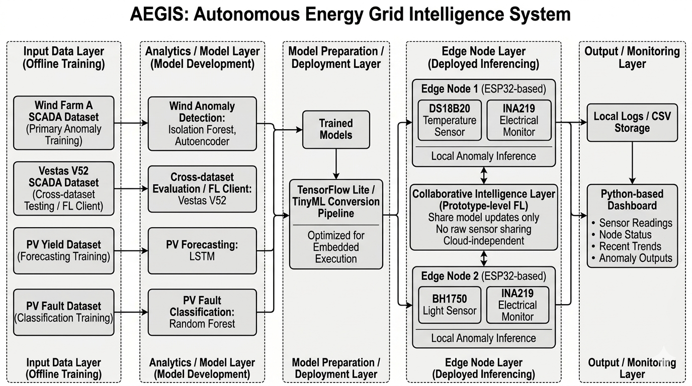

# ⚡ AEGIS  
## Autonomous Energy Grid Intelligence System

AEGIS is an Edge AI-based renewable energy monitoring and predictive monitoring platform developed for intelligent, autonomous monitoring of distributed renewable energy systems.

The system combines **ESP32-based edge computing, TensorFlow Lite anomaly detection, federated learning concepts, real-time sensor monitoring, and gesture-controlled human–machine interaction** to enable efficient and reliable renewable energy asset management.

Developed as a Final Year Project at **University of the West of England (UWE Bristol)**.

---

# Project Overview

Renewable energy systems such as solar panels and wind turbines require continuous monitoring to detect performance degradation, abnormal behaviour, and potential faults.

Traditional monitoring solutions often rely on cloud-based processing, creating challenges in remote locations due to connectivity limitations, latency, and privacy concerns.

AEGIS addresses these challenges by implementing an **edge intelligence architecture**, where machine learning models are designed for local operation on ESP32 microcontrollers and validated through embedded prototype testing for real-time anomaly detection without requiring cloud dependency.

The system consists of two autonomous monitoring nodes:

- **Node 01: Wind Energy Monitoring Node**
  - Temperature monitoring
  - Electrical parameter monitoring
  - Edge AI anomaly detection

- **Node 02: Solar Energy Monitoring Node**
  - Light intensity monitoring
  - Electrical parameter monitoring
  - Edge AI anomaly detection

---

# Key Features

## ⚡ Edge AI Predictive Monitoring

- Real-time anomaly detection using Autoencoder neural networks
- TensorFlow Lite deployment on ESP32 microcontrollers
- Fully offline inference capability
- Reconstruction error-based fault identification
- Optimised INT8 quantised models for embedded deployment

---

## 🌱 Renewable Energy Monitoring

The system monitors renewable energy parameters including:

### Wind Monitoring Node

- Temperature (DS18B20)
- Voltage measurement
- Current measurement
- Power estimation
- AI-based abnormal condition detection

### Solar Monitoring Node

- Light intensity measurement
- Voltage measurement
- Current measurement
- Power estimation
- AI-based abnormal condition detection

---

# System Architecture



---

# Machine Learning Pipeline

AEGIS implements an anomaly detection pipeline consisting of:

1. Data collection from renewable energy monitoring systems
2. Data preprocessing and feature engineering
3. Baseline anomaly detection comparison
4. Autoencoder model development
5. Threshold sensitivity analysis
6. Cross-site transfer evaluation
7. Federated learning experiments
8. Model quantisation for edge deployment
9. ESP32 real-world validation

---

# Machine Learning Methods

The project evaluates multiple anomaly detection approaches:

## Baseline Models

- Isolation Forest
- Local Outlier Factor
- One-Class Support Vector Machine

## Proposed Model

- Deep Autoencoder Neural Network

The Autoencoder learns normal operating behaviour and identifies abnormal conditions through increased reconstruction error.

---

# Federated Learning Experiment

AEGIS explores federated learning for distributed renewable energy monitoring.

Instead of transferring raw operational data, simulated edge nodes train locally and model aggregation experiments are performed to evaluate federated learning feasibility.

Advantages:

- Improved privacy
- Reduced communication requirements
- Distributed intelligence
- Suitable for remote renewable energy installations

---

# Edge Deployment

The trained anomaly detection models are converted into TensorFlow Lite format and deployed on ESP32 devices.

Deployment includes:

- Model quantisation
- Memory optimisation
- Embedded inference testing
- Real-time sensor integration
- Local anomaly classification

---

# Interactive Dashboard

AEGIS includes a real-time Streamlit monitoring dashboard for visualising and analysing renewable energy system behaviour.

The dashboard provides:

- Live sensor monitoring
- Real-time anomaly detection status
- Interactive Plotly visualisations
- MSE anomaly score monitoring
- Node online/offline status
- Historical anomaly event logging
- Multi-node comparison

---

# Gesture-Controlled Human Machine Interface

To improve user interaction, AEGIS integrates a webcam-based gesture recognition system using **MediaPipe Hands**.

The dashboard can be controlled without physical input through hand gestures.

## Supported Gestures

| Gesture | Function |
|---|---|
| 🖐 Open Palm | Open Node 01 Wind Monitoring View |
| ☝ One Finger | Open Node 01 Wind Monitoring View |
| ✌ Peace Gesture | Open Node 02 Solar Monitoring View |
| → Right Swipe | Navigate to Node 02 |
| ✊ Closed Fist | Return to Main Dashboard |

The gesture interface performs:

- Real-time hand landmark detection
- Finger state classification
- Swipe detection
- Hold-based activation to reduce false triggers
- Browser-to-dashboard communication

This provides a futuristic touch-free monitoring interface suitable for remote renewable energy environments.

---

# Hardware Components

## Microcontrollers

- ESP32 Development Board

## Sensors

### Wind Node

- DS18B20 Temperature Sensor
- INA219 Current/Voltage Sensor

### Solar Node

- BH1750 Light Sensor
- INA219 Current/Voltage Sensor

## Power System

- Solar energy harvesting
- Battery storage
- Voltage regulation modules

---

# Software Technologies

## Embedded Development

- Arduino IDE
- ESP32 Development Framework
- TensorFlow Lite Micro

## Machine Learning

- Python
- TensorFlow
- Keras
- Scikit-learn
- NumPy
- Pandas

## Dashboard

- Streamlit
- Plotly
- MediaPipe Hands
- JavaScript
- HTML/CSS

## Engineering Tools

- MATLAB
- KiCad
- NI Multisim

---

# Repository Structure

```

AEGIS-Edge-AI-Renewable-Monitoring/

│
├── Arduino_AEGIS/
│   ├── AEGIS_Node1/
│   ├── AEGIS_Node1_TFLite/
│   ├── AEGIS_Node2/
│   └── AEGIS_Node2_TFLite/
│
├── dashboard/
│   ├── aegis_dashboard.py
│   ├── serial_logger.py
│   └── data/
│
├── scripts/
│   ├── train_node1_ae.py
│   ├── train_node2_ae.py
│   ├── convert_model.py
│   └── export_scaler_params.py
│
├── figures/
│
├── 00_config.ipynb
├── 01_data_audit.ipynb
├── 02_baselines.ipynb
├── 03_local_autoencoder.ipynb
├── 04_threshold_sensitivity.ipynb
├── 05_cross_site_transfer.ipynb
├── 06_federated_learning.ipynb
├── 07_quantization_edge_eval.ipynb
├── 08_esp32_live_validation.ipynb
├── 09_figures_tables.ipynb


````

---

# Running the Dashboard

Install required dependencies:

```bash
pip install -r dashboard/requirements.txt
````

Run the dashboard:

```bash
cd dashboard
streamlit run aegis_dashboard.py
```

---

# Project Objectives

The main objectives of AEGIS are:

* Develop an autonomous renewable energy monitoring platform
* Implement AI-based predictive maintenance at the edge
* Reduce dependency on cloud computing
* Enable intelligent fault detection in remote areas
* Explore privacy-preserving federated learning
* Demonstrate practical deployment of AI on low-power embedded systems

---

# Future Improvements

Possible future extensions include:

* Real wind turbine and solar farm deployment
* Additional environmental sensors
* Advanced fault classification models
* LoRa-based long-range communication
* Cloud-edge hybrid analytics
* Mobile application integration
* More advanced federated learning strategies

---

## Author

**Mohamed Khaja Moinudeen**

BEng (Hons) Electrical and Electronic Engineering  
University of the West of England (UWE Bristol)

Final Year Project: AEGIS

Final Year Project
AEGIS - Autonomous Energy Grid Intelligence System
